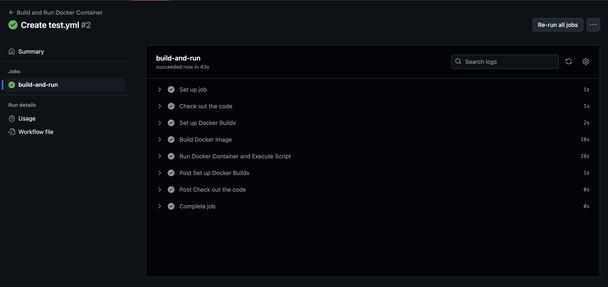

# Sample API

This is a sample api. 

## Technology Used
- [x] [Python](https://www.python.org)
- [x] [FastAPI](https://fastapi.tiangolo.com)
- [x] [SQLAlchemy](https://www.sqlalchemy.org)
- [x] [Poetry](https://python-poetry.org)
- [x] [Flyway](https://www.red-gate.com/products/flyway/community/)
- [x] [Docker Compose](https://docs.docker.com/compose/install/)

## Setup

### Environment variables

The following environment variables are expected:

- ORIGINS: comma separated list of [allowed origins](https://fastapi.tiangolo.com/tutorial/cors/).
- POSTGRES_SERVER: URL of db server
- POSTGRES_USER
- POSTGRES_PASSWORD
- POSTGRES_DB: postgres DB name

### DB adaptor

The [psycopg2](https://www.psycopg.org) adaptor is used. Note the [installation requirements](https://www.psycopg.org/docs/install.html) for the psycopg2 package. The [sample-api dependencies](pyproject.toml) use the psycopg2 package and not the psycopg2-binary package.
    
## Local Development

### Running locally

- Run `docker compose up` command from root directory to start the entire stack. The following will be started: 
  - Postgres server 
  - Flyway - it setups the postgres tables and inserts some dev data.
  - sample-api server
- Environment variables are defined in the docker-compose.yml
- The `sample-api` folder is volume mounted, so any changes to the code will be reflected in the container 
- The API's documentation is available at [http://localhost:3003/docs](http://localhost:3003/docs).


### Unit tests

- Run `docker compose --profile test up` command to run the unit tests from the root directory. This will run the above services as well as the unit tests.
- The folder is volume mounted, so any changes to the code will be reflected in the container and run the unit tests again.


## The API

This is a simple API. It is not production ready. 

The API is based on the table schema defined in [V1.0.0__init.sql](db/migrations/V1.0.0__init.sql) file. Note the foreign key constraint if you want to try the endpoints out.

The [http://localhost:3003/docs](http://localhost:3003/docs) page lists the available endpoints.


## Run the containers
> ./run.sh

- This script utilizes the `docker-setup.sh` to execute the docker file build process and run the containers

`docker-setup.sh`
- Set File Paths: The script defines paths to environment variable files in the docker/.env/ directory for Flyway, Postgres, Python, and shared variables.

- Read Environment Variables: It reads the contents of these files and concatenates them into a single string of environment variables.

- Export Variables: It exports the environment variables defined in the concatenated string, provided they do not contain unresolved variable references.

- Process and Write Variables: It reads a file line-by-line, extracting key-value pairs. If the value contains unresolved variable references, it resolves them using eval and writes the result to the output file. If not, it writes the key-value pair directly.

## Pipeline 
GitHub Actions Workflow for Docker Container
============================================

This GitHub Actions workflow builds a Docker image and runs a container to execute a script inside it. It is triggered on push and pull request events to the `main` branch.

Workflow Overview
-----------------

The workflow performs the following steps:

1.  **Checkout Code:** Retrieves the code from the repository.
2.  **Set up Docker Buildx:** Configures Docker Buildx to enable multi-platform builds.
3.  **Build Docker Image:** Builds the Docker image using the specified Dockerfile.
4.  **Run Docker Container and Execute Script:** Runs the Docker container and executes a specified script inside it.


Github Workflow Execution
--------------------------


Workflow File
-------------

The workflow is defined in the `.github/workflows/unit-test-simplified.yml` file.

### Workflow Configuration

```yaml

name: Build and Run Docker Container

on:
  push:
    branches:
      - main
  pull_request:
    branches:
      - main

jobs:
  build-and-run:
    runs-on: ubuntu-latest
    env:
      DOCKER_IMAGE_NAME: test
      DOCKER_IMAGE_TAG: latest
      SCRIPT_PATH: /application/run-unit-tests.sh
      DOCKER_FILE_LOC: docker/Dockerfile-test

    steps:
      - name: Check out the code
        uses: actions/checkout@v3

      - name: Set up Docker Buildx
        uses: docker/setup-buildx-action@v2

      - name: Build Docker Image
        run: |
          docker build -t ${{ env.DOCKER_IMAGE_NAME }}:${{ env.DOCKER_IMAGE_TAG }} -f ${{  env.DOCKER_FILE_LOC }} .
      - name: Run Docker Container and Execute Script
        run: |
          docker run --rm ${{ env.DOCKER_IMAGE_NAME }}:${{ env.DOCKER_IMAGE_TAG }} ${{ env.SCRIPT_PATH }} `
```
### Environment Variables

-   **DOCKER_IMAGE_NAME**: The name of the Docker image to build (default: `test`).
-   **DOCKER_IMAGE_TAG**: The tag for the Docker image (default: `latest`).
-   **SCRIPT_PATH**: The path to the script to be executed inside the container (default: `/application/run-unit-tests.sh`).
-   **DOCKER_FILE_LOC**: The location of the Dockerfile (default: `docker/Dockerfile-test`).

### Steps Explained

1.  **Check out the code:** Uses `actions/checkout@v3` to check out the code from the repository.
2.  **Set up Docker Buildx:** Uses `docker/setup-buildx-action@v2` to set up Docker Buildx for building images.
3.  **Build Docker Image:** Builds the Docker image with the specified name and tag using the Dockerfile located at `DOCKER_FILE_LOC`.
4.  **Run Docker Container and Execute Script:** Runs the Docker container and executes the script located at `SCRIPT_PATH`. The container is removed after execution due to the `--rm` flag.
